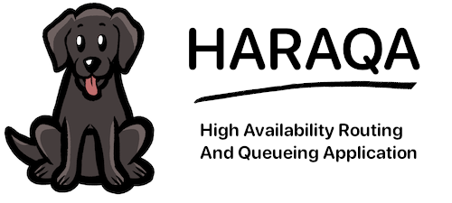

Haraqa
======
High Availability Routing And Queueing Application
--------------------------------------------------



[](https://godoc.org/github.com/haraqa/haraqa)
[](https://goreportcard.com/report/haraqa/haraqa)
[](https://github.com/haraqa/haraqa/releases)
[](https://github.com/haraqa/haraqa/blob/master/LICENSE)
[](https://github.com/emersion/stability-badges#experimental)
[](https://hub.docker.com/r/haraqa/haraqa/)

**haraqa** is designed to be a developer friendly, highly scalable message queue for data persistence and communication between microservices.

#### Table of Contents
* [About the Project](#about-the-project)
  * [Usecases](#usecases)
* [Getting Started](#getting-started)
  * [Client](#client)
  * [Broker](#broker)
  * [Installation](#installation)
* [Usage](#usage)
* [Contributing](#contributing)
* [License](#license)

## About the Project
### Usecases
#### Log Aggregation
Haraqa can be used by services to persist logs for debugging or auditing. See the
[Example](https://github.com/haraqa/haraqa/tree/master/examples/logs) for more information.

#### Message routing between clients
In this [Example](https://github.com/haraqa/haraqa/tree/master/examples/message_routing)
http clients can send and receive messages asynchronously through POST and GET requests
to a simple REST server. These messages are stored in haraqa in a topic unique to each client.

## Getting started
### Client
```
go get github.com/haraqa/haraqa
```
##### Hello World
```
package main

import (
  "context"
  "log"

  "github.com/haraqa/haraqa"
)

func main() {
  config := haraqa.DefaultConfig
  client, err := haraqa.NewClient(config)
  if err != nil {
    panic(err)
  }
  defer client.Close()

  var (
    ctx = context.Background()
    topic = []byte("my_topic")
    msg1 = []byte("hello")
    msg2 = []byte("world")
    offset = 0
  )

  // produce messages in a batch
  err = client.Produce(ctx, topic, msg1, msg2)
  if err != nil {
    panic(err)
  }

  // consume messages in a batch
  resp := haraqa.ConsumeResponse{}
  err = client.Consume(ctx, topic, offset, maxBatchSize, &resp)
  if err != nil {
    panic(err)
  }

  msgs, err := resp.Batch()
  if err != nil {
    panic(err)
  }

  log.Println(msgs)
}
```
### Broker
The recommended deployment strategy is to use [Docker](hub.docker.com/r/haraqa/haraqa)
#### Locally
```
docker run -it -p 4353:4353 -p 14353:14353 -v $PWD/v1:/v1 haraqa/haraqa /v1
```
#### Kubernetes
```

```

## Contributing
We want this project to be the best it can be and all feedback, feature requests or pull requests are welcome.

## License
MIT © 2019 [haraqa](https://github.com/haraqa/) and [contributors](https://github.com/haraqa/haraqa/graphs/contributors). See `LICENSE` for more information.